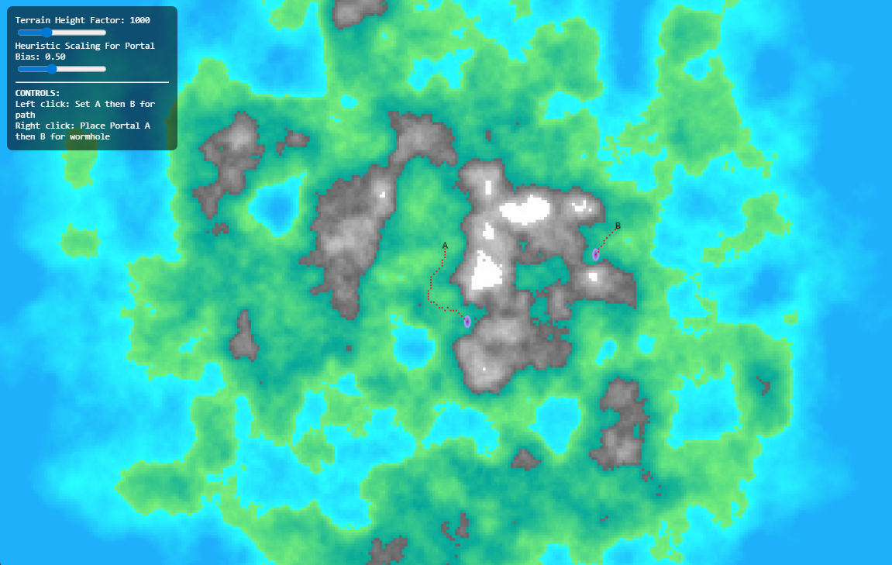

# Island Router

Created for 2-day BIT case. This project generates a procedural perlin noise based island map, and uses an A\* search algorithm to find the most efficient route between two user-selected points. To make things more interesting, the user can place down two portals to create a wormhole across the map, which the search algorithm can consider using!

